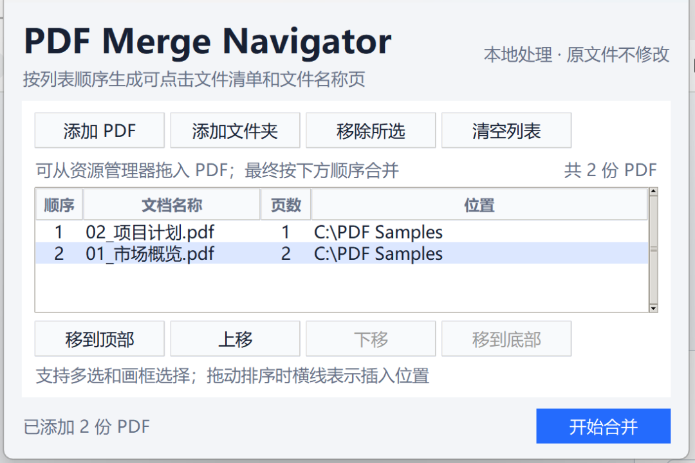

# PDF Merge Navigator

[](https://github.com/ClassicJJ/pdf-merge-navigator/actions/workflows/tests.yml)
[](https://github.com/ClassicJJ/pdf-merge-navigator/releases/latest)
[](https://github.com/ClassicJJ/pdf-merge-navigator/releases)
[](LICENSE)

[中文](#中文说明) · [English](#english)

一款面向 Windows 的本地 PDF 组卷工具：按指定顺序合并文件，生成可点击的文件清单和标题页，并将页面等比例适配为 A4。文件全程保留在本机。



## 下载 Windows 版

**[下载最新版 PDF-Merge-Navigator.exe](https://github.com/ClassicJJ/pdf-merge-navigator/releases/latest/download/PDF-Merge-Navigator.exe)**

无需安装，下载后直接运行。Windows 可能会因为程序尚未进行商业代码签名而显示 SmartScreen 提示；请只从本项目的 GitHub Releases 下载。

## 中文说明

### 主要功能

- 多选或拖入 PDF，也可以载入文件夹第一层的全部 PDF。
- 通过拖动、按钮和快捷键调整单个或多个文件的顺序。
- 生成“可点击文件清单 → 文件标题页 → 原 PDF 内容”的完整文档。
- 所有源页面按原始横竖方向等比例适配 A4，不裁切、不拉伸。
- 尽量保留源 PDF 的页面内容和内部链接。
- 不修改源文件；结果保存到 Windows 桌面且不会覆盖已有文件。
- 完全本地处理，不上传文件，不需要账号或网络。

### 使用方法

1. 从上面的链接或 [GitHub Releases](https://github.com/ClassicJJ/pdf-merge-navigator/releases) 下载 `PDF-Merge-Navigator.exe`。
2. 双击运行，添加或拖入 PDF。
3. 调整列表顺序，然后点击“开始合并”。
4. 合并结果将保存到 Windows 桌面。

Windows 可能会对尚未进行商业代码签名的新应用显示 SmartScreen 提示。请只从本项目的 GitHub Releases 下载程序，或按照下面的开发说明从源码运行。

### 处理规则

- 输出名称为 `PDF 合并输出_YYYY-MM-DD-01.pdf`，同日再次合并会递增编号。
- 重复、损坏、无页面或需要密码的 PDF 不会加入列表。
- 文件夹载入不递归读取子文件夹，文件名按自然顺序排列。
- 数字签名不会成为合并结果中的有效签名。
- 页面比例不同产生的空白会保留为页边空白。

### 从源码运行

需要 Python 3.11 或更新版本：

```powershell
python -m venv .venv
.\.venv\Scripts\python.exe -m pip install -r requirements-build.txt
.\.venv\Scripts\python.exe -m pytest -q
.\.venv\Scripts\python.exe run_tool.py
```

构建并验证 Windows 单文件程序：

```powershell
powershell -ExecutionPolicy Bypass -File scripts\build_windows.ps1
```

构建结果位于 `output\PDF-Merge-Navigator.exe`。

## English

PDF Merge Navigator is a privacy-first Windows desktop utility for assembling multiple PDFs into one navigable document. It creates a clickable file index and a title page for each source document, while fitting every source page proportionally onto A4 without cropping or stretching.

### Highlights

- Add multiple PDFs by file picker, drag and drop, or folder.
- Reorder one or multiple documents with drag actions, buttons, or keyboard shortcuts.
- Generate a clickable document index and per-file title pages.
- Preserve source content and internal links where possible.
- Keep all processing local: no upload, account, or network connection required.
- Never modify source files or overwrite an existing output.

### Development

Python 3.11 or newer is required. Follow the PowerShell commands in [从源码运行](#从源码运行) to install dependencies, run the tests, launch the application, and build the Windows executable.

## Contributing and security

Contributions are welcome. See [CONTRIBUTING.md](CONTRIBUTING.md). Please report vulnerabilities according to [SECURITY.md](SECURITY.md) and never upload sensitive PDFs to a public Issue.

## License

Released under the [MIT License](LICENSE). Third-party components and their licenses are listed in [THIRD-PARTY-NOTICES.txt](THIRD-PARTY-NOTICES.txt).
